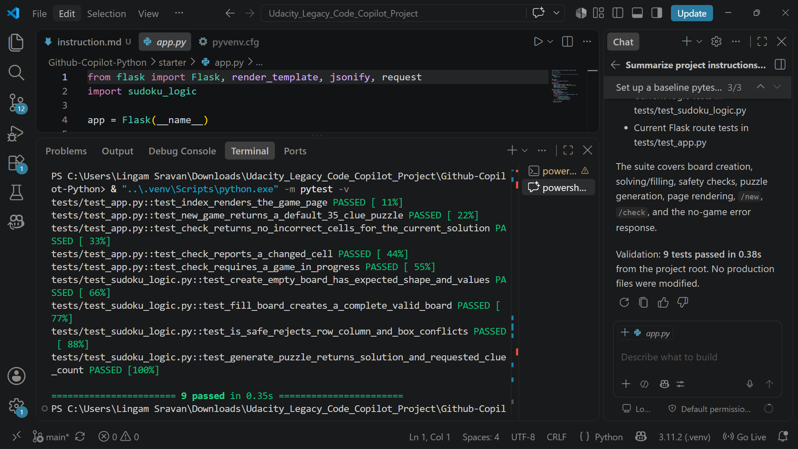
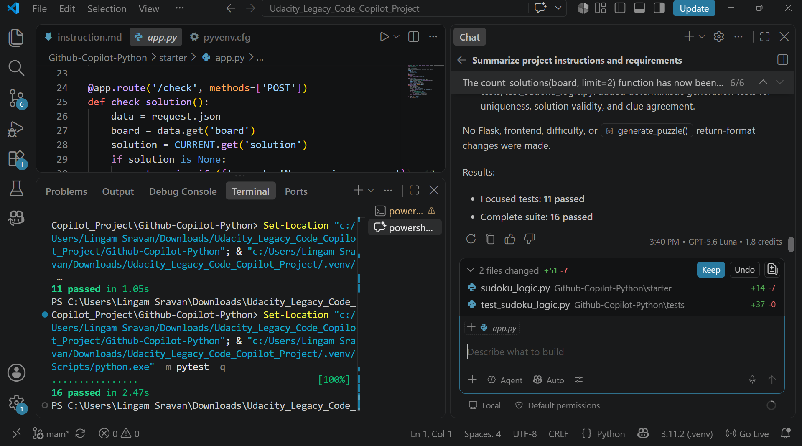
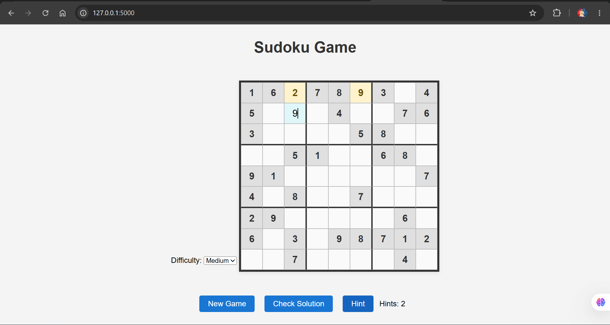
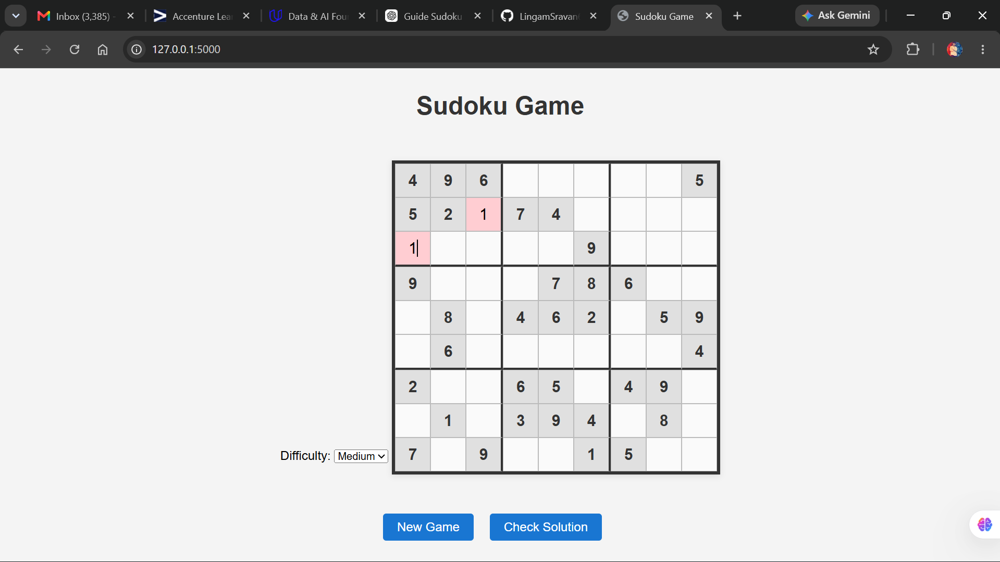
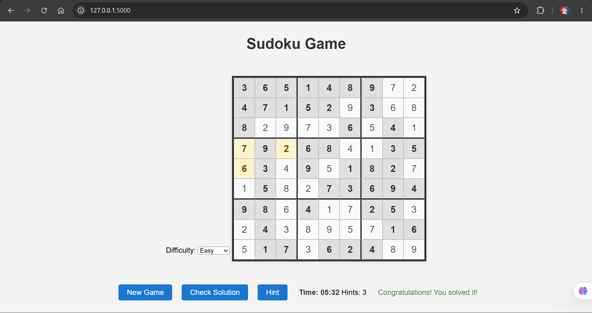
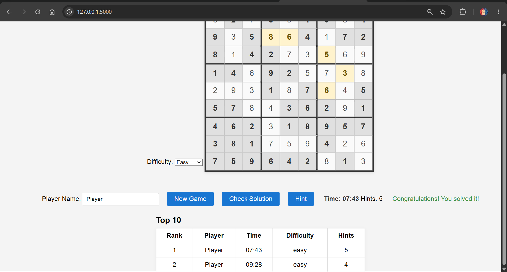
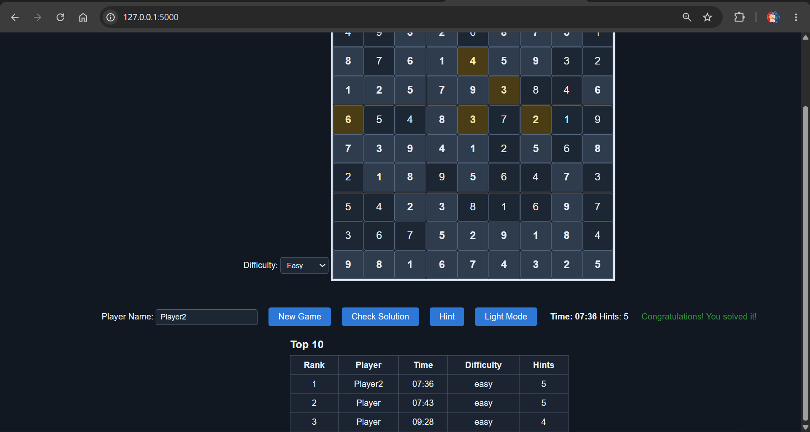
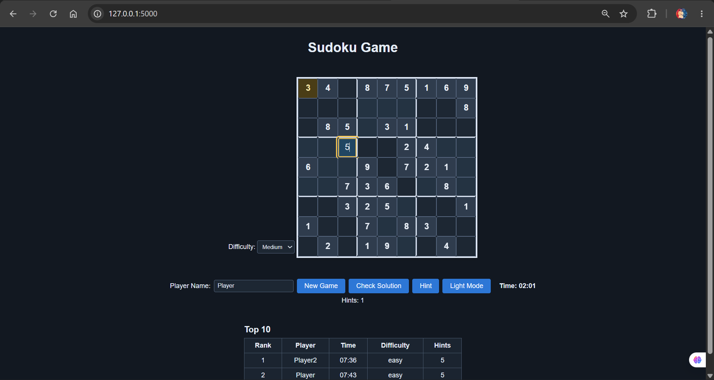
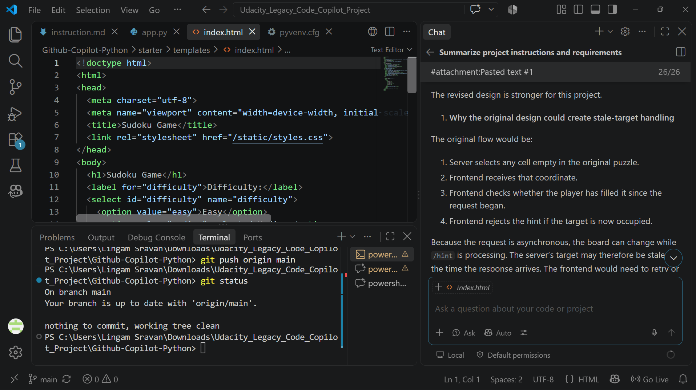

# Refactoring Legacy Code with GitHub Copilot

## Project Overview

This project refactors a legacy Flask Sudoku application into a maintainable,
interactive Sudoku game with assistance from GitHub Copilot. The application
keeps the Flask backend lightweight while separating Sudoku logic, browser
interaction, styling, testing, and Copilot workflow evidence.

## Features

- Unique-solution Sudoku puzzle generation
- Easy, Medium, and Hard difficulty levels
- Locked prefilled cells
- Immediate row, column, and 3x3 conflict feedback
- Check Solution functionality with incorrect-cell feedback
- Hint button that fills one correct cell and locks it
- Game timer
- Completion and congratulations state
- Persistent Top 10 leaderboard
- Player name, completion time, difficulty, and hints-used score fields
- Score persistence through browser `localStorage`
- Dark Mode with persisted theme preference
- Alternating 3x3 Sudoku box colors
- Responsive desktop and mobile layout

## Project Structure

```text
starter/
	app.py                    Flask routes and in-memory current game state
	sudoku_logic.py           Sudoku generation, solving, and validation logic
	templates/index.html      Game page markup
	static/main.js            Browser game interaction and UI state
	static/styles.css         Light/dark themes and responsive styling
tests/                      pytest tests for logic and Flask routes
Screenshots/                Copilot workflow and feature evidence
instruction.md              Project-specific Copilot instructions
README.md                   Project documentation
```

Generated files such as `__pycache__`, `.pyc`, and `.pytest_cache` are not part
of the documented project structure or submission content.

## Technologies Used

- Python 3
- Flask
- HTML
- CSS
- JavaScript
- pytest
- GitHub Copilot

## Installation and Setup

From the repository root, create and activate a virtual environment in
PowerShell:

```powershell
python -m venv .venv
.\.venv\Scripts\Activate.ps1
```

Install the project dependencies:

```powershell
pip install -r starter/requirements.txt
```

## Running the Application

Run Flask from the repository root:

```powershell
python starter/app.py
```

Open http://127.0.0.1:5000 in a modern web browser.

## Running Tests

After activating the virtual environment and installing the dependencies, run
the complete test suite from the repository root:

```powershell
python -m pytest -q
```

The current complete suite contains 31 tests.

## Testing Approach

Baseline tests were established and run before the refactoring work. The
complete suite was rerun after significant milestones. Tests cover Sudoku
validity, solution counting, unique-solution generation, difficulty mapping,
Flask routes, Hint behavior, and invalid payload handling. Browser-facing
features such as the timer, Check feedback, leaderboard, Dark Mode, and
responsive layout were also manually verified.

## GitHub Copilot Usage

GitHub Copilot was used to help analyze the legacy code, establish baseline
tests, plan incremental refactoring, implement unique-solution validation and
game features, and develop styling and responsive behavior. Suggestions were
reviewed against the project requirements rather than accepted blindly. For
example, the initial Hint design was modified so the current visible board is
sent to `/hint`, allowing the server to avoid cells already filled by the
player.

Evidence of the workflow is available in `Screenshots/`.

## Screenshots

### Initial Test Setup
Baseline pytest framework was configured before refactoring. All initial tests passed successfully.



### Unique Solution Validation
GitHub Copilot was used to analyze and implement unique-solution Sudoku generation.



### Hint Feature
The Hint feature fills one correct empty cell, locks it, and increments the hint counter.



### Invalid Move Feedback
Invalid Sudoku entries receive immediate visual feedback for row, column, and 3x3-box conflicts.



### Timer and Completion
The timer tracks game duration and stops when the puzzle is completed successfully.



### Top 10 Leaderboard
Completed games are saved to a persistent Top 10 leaderboard using browser localStorage.



### Dark Mode
The entire Sudoku interface supports persistent light and dark themes.



### Responsive 3x3 Sudoku Styling
The Sudoku board uses alternating 3x3 square colors and adapts to desktop and mobile layouts.



### Responsible Copilot Evaluation
A Copilot suggestion was reviewed and modified rather than accepted blindly.



## How to Play

1. Enter a player name.
2. Choose Easy, Medium, or Hard.
3. Start a new game.
4. Fill the editable cells.
5. Use Hint when needed.
6. Use Check Solution to verify entries.
7. Complete the puzzle to save the score to Top 10.
8. Toggle Dark Mode when desired.

## Notes

- Scores are stored locally in the browser using `localStorage`.
- The theme preference is stored locally in the browser.
- The Flask `CURRENT` game state is in memory and is intended for this project
	demonstration rather than multi-user production deployment.

## Udacity Submission

This repository contains the complete Flask Sudoku application, its pytest
tests, `instruction.md`, and the `Screenshots/` evidence folder required for
the project workflow. The submission focuses on the required functionality and
does not add optional standout features.
